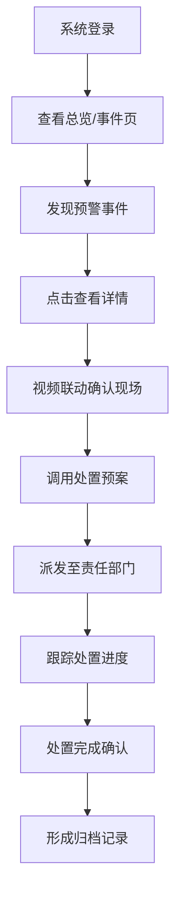
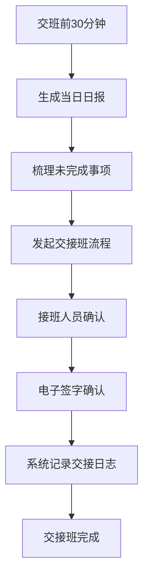

# 数字孪生城市运行驾驶舱 - 产品需求文档（PRD）

## 1. 产品概述

数字孪生城市运行驾驶舱是面向城运中心值班人员的一体化智能监控平台，通过三维数字孪生技术实现城区实时态势的可视化呈现与智能处置。系统整合交通、管网、环境、事件等多源数据，为城市精细化治理提供决策支撑。

- 核心目标：打破数据孤岛，实现"一屏观全域、一网管全城"
- 目标用户：城运中心值班人员、指挥调度人员、街道网格员

## 2. 核心功能

### 2.1 用户角色

| 角色 | 核心权限 |
|------|----------|
| 值班人员 | 查看实时数据、标记事件、截图记录、导出日报 |
| 指挥调度员 | 处置事件、调用预案、视频联动、大屏轮播 |
| 管理员 | 系统配置、用户管理、预案管理 |

### 2.2 功能模块

1. **总览页**：核心指标看板、预警概览、事件统计、值班信息
2. **地图页**：三维数字孪生地图、图层开关、重点区域收藏、历史回放
3. **交通页**：路况热力图、公交到站、交通事件、拥堵指数
4. **管网页**：积水点监测、井盖异常、管线分布、泵站状态
5. **环境页**：空气质量、噪声监测、气象数据、污染源分布
6. **事件页**：事件列表、事件弹窗、处置进度、类型筛选
7. **报表页**：日报周报、数据导出、趋势分析、值班交接

### 2.3 页面详情

| 页面名称 | 模块名称 | 功能描述 |
|-----------|-------------|---------------------|
| 总览页 | 顶部导航栏 | 时间显示、天气信息、值班信息、搜索、大屏切换 |
| 总览页 | 核心指标区 | 城区人口、今日事件、处置率、健康指数、平均响应时间 |
| 总览页 | 预警概览 | 分级预警卡片（红/橙/黄/蓝），点击跳转对应页面 |
| 总览页 | 事件趋势 | 24小时事件趋势图、7天处置对比图 |
| 总览页 | 实时动态 | 最新事件滚动播报、系统通知公告 |
| 地图页 | 三维场景 | 3D城市建筑模型、地形、光照、动态天空 |
| 地图页 | 图层控制 | 建筑/道路/水系/植被/POI图层开关，透明度调节 |
| 地图页 | 专题图层 | 交通热力/管网监测/环境站点/视频点位叠加显示 |
| 地图页 | 收藏面板 | 重点区域书签、一键飞行定位、自定义区域管理 |
| 地图页 | 时间轴 | 历史数据回放、倍速控制、快照管理 |
| 交通页 | 路况热力 | 实时交通流量热力、拥堵等级着色、车速统计 |
| 交通页 | 公交到站 | 线路列表、实时位置、预计到站时间、换乘查询 |
| 交通页 | 交通指标 | 平均车速、拥堵指数、在途车辆数、事故数量 |
| 管网页 | 积水监测 | 积水点列表、水位深度、预警状态、处置状态 |
| 管网页 | 井盖异常 | 异常列表（移位/破损/丢失）、告警时间、定位 |
| 管网页 | 泵站状态 | 泵站运行数据、液位、流量、设备健康度 |
| 环境页 | 空气质量 | AQI指数、PM2.5/PM10/O3/NO2/SO2/CO六项指标 |
| 环境页 | 噪声监测 | 功能区噪声、昼间/夜间值、超标告警 |
| 环境页 | 气象数据 | 温度、湿度、风速、风向、降雨量、能见度 |
| 事件页 | 筛选器 | 按街道、时间范围、事件类型、优先级筛选 |
| 事件页 | 事件列表 | 事件卡片、状态标签、派发状态、快速定位 |
| 事件页 | 事件弹窗 | 详情信息、附件、处置记录、视频联动 |
| 事件页 | 处置进度 | 时间线、当前节点、待办提醒、处置超时预警 |
| 事件页 | 预案调用 | 关联方案、一键派发、资源调度 |
| 报表页 | 日报生成 | 自动汇总当日数据、支持自定义编辑、一键导出 |
| 报表页 | 历史报表 | 日报/周报/月报列表、在线预览、批量下载 |
| 报表页 | 值班交接 | 交班记录、未完成事项、接班确认、交接日志 |
| 报表页 | 截图标注 | 全屏截图、自由标注、文字备注、保存/分享 |
| 通用 | 大屏轮播 | 自动切换页面、可配置轮播间隔、全屏模式 |
| 通用 | 视频联动 | 点击点位弹出视频、多路视频墙、云台控制 |
| 通用 | 方案预案 | 预案库管理、分类检索、关联事件一键调用 |

## 3. 核心流程

### 3.1 事件处置流程

值班人员登录系统后，通过总览页或事件页发现预警事件，点击查看详情，联动视频确认现场情况，根据事件类型调用对应处置预案，派发至相关部门，跟踪处置进度直至闭环，最后形成处置记录归档。

### 3.2 值班交接流程

交班前生成当日日报，梳理未完成事项，发起交接流程，接班人员确认接班并签字，系统自动记录交接时间及内容。

## 4. 用户界面设计

### 4.1 设计风格

- **设计主题**：科技感·深蓝·未来都市 / 赛博政务风
- **主色调**：深空蓝 `#0A1628`（背景）、科技蓝 `#00D4FF`（主强调）、警示橙 `#FF8A3D`（预警）、应急红 `#FF4D4F`（告警）
- **辅助色**：数据绿 `#00E68A`（正常/完成）、活力紫 `#8B7BFF`（分类标签）
- **按钮风格**：圆角 4px、发光边框、悬停呼吸光效、点击微凹陷
- **字体方案**：标题使用「HarmonyOS Sans」或「思源黑体 CN Bold」，数据看板使用「JetBrains Mono」或「D-DIN」等数字等宽字体
- **布局风格**：全屏沉浸式布局、左侧垂直导航、顶部信息栏、卡片式模块化网格、角标科技感边框装饰
- **图标风格**：线性描边图标 + 发光填充状态，使用 Ant Design Icons 或 Feather Icons
- **动效设计**：数据刷新时数字滚动动画、卡片悬停微微上浮、页面切换淡入平移、警告图标脉冲闪烁

### 4.2 页面设计概览

| 页面名称 | 模块名称 | UI 元素 |
|-----------|-------------|----------|
| 总览页 | 核心指标区 | 渐变色数字卡片、发光边框、同比/环比小箭头、背景数据流动线条 |
| 地图页 | 三维场景 | 蓝色调城市模型、黄色道路光带、动态流光路径、漂浮标签、光晕粒子 |
| 交通页 | 路况热力 | 绿-黄-红渐变热力带、流动车辆光斑、拥堵脉冲闪烁标记 |
| 事件页 | 事件列表 | 优先级色边卡片、状态徽标、时间线连接、处置进度条动画 |
| 报表页 | 日报展示 | 仿纸质文档排版、分栏统计表格、可编辑批注区、导出按钮 |

### 4.3 响应式

- **布局策略**：桌面优先设计（1920×1080 为基准），适配 2K/4K 大屏显示
- **大屏适配**：通过 CSS 变量 + rem 单位实现等比缩放，支持 16:9 大屏电视墙
- **触控优化**：按钮最小点击区域 48px，弹窗支持拖拽移动，地图支持手势缩放旋转
- **分屏支持**：大屏轮播模式下支持 1×2、2×2 多屏分栏展示

### 4.4 3D 场景指导

- **环境/HDRI**：使用程序化天空盒，支持昼/黄昏/夜三种模式自动切换（根据系统时间），夜间模式开启城市灯光
- **光照设置**：方向光模拟太阳光 + 半球光环境光 + 建筑点光源/区域光补光，夜间模式增加道路灯带自发光
- **相机设置**：初始视角 45° 俯瞰城市中心，支持鼠标左键旋转、右键平移、滚轮缩放，最大倾斜角 80°
- **场景构图**：中心区域为核心商圈高保真模型，外围区域简模建筑，远景天际线轮廓，水面反射效果
- **交互动画**：点击建筑高亮描边 + 弹出信息面板，POI 点上下浮动 + 呼吸光圈，车辆粒子沿道路流动
- **后处理效果**：Bloom 泛光、SSAO 环境光遮蔽、FXAA 抗锯齿、轻微色差营造赛博感
- **性能预算**：建筑面数控制在 50 万面以内，使用 GPU Instancing 渲染车辆/树木，LOD 分级加载，目标帧率 45+ FPS

## 5. 非功能需求

| 类型 | 要求 |
|------|------|
| 性能 | 页面首屏加载 < 3s，3D 场景帧率 > 30 FPS，数据刷新延迟 < 2s |
| 兼容性 | Chrome 90+ / Edge 90+ / Firefox 88+，大屏 WebView 环境 |
| 可用性 | 7×24 小时稳定运行，月度可用性 > 99.9% |
| 安全 | 操作日志审计、数据传输 HTTPS、敏感信息脱敏 |
| 数据 | 支持 Mock 数据 + 真实 WebSocket 接口可切换 |
