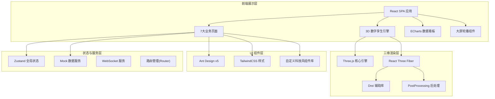

# 数字孪生城市运行驾驶舱 - 技术架构文档

## 1. 架构设计



## 2. 技术栈说明

### 2.1 核心框架

| 技术 | 版本 | 用途 |
|------|------|------|
| React | 18.x | 前端 UI 框架 |
| TypeScript | 5.x | 类型安全 |
| Vite | 5.x | 构建工具与开发服务器 |
| React Router | 6.x | 前端路由管理 |

### 2.2 三维可视化

| 技术 | 版本 | 用途 |
|------|------|------|
| three | 0.160.x | 3D 渲染核心引擎 |
| @react-three/fiber | 8.x | React 声明式 Three.js 封装 |
| @react-three/drei | 9.x | R3F 常用组件辅助库 |
| @react-three/postprocessing | 2.x | 后处理特效（Bloom、SSAO等） |
| three-stdlib | 2.x | Three.js 标准库补充 |

### 2.3 数据可视化

| 技术 | 版本 | 用途 |
|------|------|------|
| echarts | 5.x | 图表渲染 |
| echarts-for-react | 3.x | React ECharts 封装 |

### 2.4 UI 框架

| 技术 | 版本 | 用途 |
|------|------|------|
| antd | 5.x | 企业级 UI 组件库 |
| tailwindcss | 3.x | 原子化 CSS 框架 |
| @ant-design/icons | 5.x | 图标库 |

### 2.5 状态与工具

| 技术 | 版本 | 用途 |
|------|------|------|
| zustand | 4.x | 轻量全局状态管理 |
| date-fns | 3.x | 日期处理工具 |
| html2canvas | 1.x | 截图标注功能 |
| jspdf | 2.x | PDF 报表导出 |
| @types/node | 20.x | Node 类型定义 |

### 2.6 数据策略

- **Mock 数据**：使用 `src/mock/` 目录下的 Mock 数据，模拟真实业务数据
- **数据刷新**：通过 setInterval 模拟实时数据推送，刷新间隔 3s/10s/60s 可配置
- **WebSocket 预留**：`src/services/` 目录下预留 WebSocket 服务封装接口，方便后续接入真实后端

## 3. 路由定义

| 路由路径 | 页面组件 | 页面标题 |
|----------|----------|----------|
| `/overview` | `pages/Overview` | 运行总览 |
| `/map` | `pages/Map3D` | 三维地图 |
| `/traffic` | `pages/Traffic` | 交通态势 |
| `/pipeline` | `pages/Pipeline` | 管网监测 |
| `/environment` | `pages/Environment` | 环境监测 |
| `/events` | `pages/Events` | 事件中心 |
| `/reports` | `pages/Reports` | 报表中心 |
| `*` | 重定向至 `/overview` | - |

## 4. 数据模型

### 4.1 核心数据结构

```typescript
// 通用告警等级
type AlertLevel = 'critical' | 'warning' | 'notice' | 'info';

// 事件状态
type EventStatus = 'pending' | 'processing' | 'dispatched' | 'resolved' | 'closed';

// 事件类型
type EventCategory = 'traffic' | 'pipeline' | 'environment' | 'security' | 'facility' | 'public';

// 街道列表
type District = '中心街道' | '南湖街道' | '北海街道' | '东山街道' | '西河街道' | '工业园区';

// 核心指标
interface CoreMetrics {
  totalPopulation: number;
  todayEvents: number;
  resolutionRate: number;
  cityHealthIndex: number;
  avgResponseTime: number;
  activeCameras: number;
  onlineSensors: number;
}

// 预警统计
interface AlertSummary {
  level: AlertLevel;
  count: number;
  trend: 'up' | 'down' | 'flat';
  trendValue: number;
  items: AlertItem[];
}

// 事件详情
interface CityEvent {
  id: string;
  title: string;
  category: EventCategory;
  level: AlertLevel;
  status: EventStatus;
  district: District;
  address: string;
  reportTime: string;
  description: string;
  reporter: string;
  phone: string;
  images?: string[];
  videos?: string[];
  handler?: string;
  deadline?: string;
  progress: EventProgressItem[];
  planId?: string;
  position: [number, number, number];
}

// 处置进度
interface EventProgressItem {
  time: string;
  actor: string;
  action: string;
  remark?: string;
}

// 三维图层
type LayerType = 'buildings' | 'roads' | 'water' | 'vegetation' | 'poi' | 'traffic_heat' | 'pipeline' | 'environment' | 'camera';

// 视频点位
interface CameraPoint {
  id: string;
  name: string;
  status: 'online' | 'offline';
  position: [number, number, number];
  district: District;
  streamUrl: string;
}

// 积水点
interface FloodPoint {
  id: string;
  name: string;
  waterLevel: number; // cm
  warningLevel: AlertLevel;
  position: [number, number, number];
  status: 'monitoring' | 'processing' | 'resolved';
  updateTime: string;
}

// 井盖异常
interface ManholeIssue {
  id: string;
  code: string;
  type: 'shifted' | 'broken' | 'missing';
  level: AlertLevel;
  reportTime: string;
  position: [number, number, number];
  status: EventStatus;
  handler?: string;
}

// 空气质量
interface AirQuality {
  aqi: number;
  level: 'excellent' | 'good' | 'light' | 'moderate' | 'heavy' | 'severe';
  pm25: number;
  pm10: number;
  o3: number;
  no2: number;
  so2: number;
  co: number;
  station: string;
  updateTime: string;
}

// 噪声监测
interface NoiseData {
  id: string;
  name: string;
  dayValue: number; // dB
  nightValue: number;
  standardDay: number;
  standardNight: number;
  exceed: boolean;
  position: [number, number, number];
}

// 交通路况
interface TrafficRoad {
  id: string;
  name: string;
  level: 'smooth' | 'slow' | 'congested' | 'blocked';
  speed: number; // km/h
  vehicles: number;
  path: [number, number, number][];
}

// 公交信息
interface BusInfo {
  lineNo: string;
  from: string;
  to: string;
  nextStation: string;
  eta: number; // 分钟
  currentStation: string;
  passengers: number;
}

// 处置预案
interface EmergencyPlan {
  id: string;
  title: string;
  category: EventCategory;
  level: AlertLevel;
  content: string;
  steps: string[];
  contacts: { name: string; role: string; phone: string }[];
  resources: { name: string; count: number; unit: string }[];
}

// 值班记录
interface DutyRecord {
  date: string;
  shift: 'morning' | 'afternoon' | 'night';
  handoverName: string;
  successorName: string;
  handoverTime: string;
  unfinishedItems: string[];
  remarks: string;
  signature: string;
}

// 日报数据
interface DailyReport {
  date: string;
  metrics: CoreMetrics;
  alertCount: { critical: number; warning: number; notice: number; info: number };
  eventSummary: { total: number; resolved: number; processing: number };
  topEvents: CityEvent[];
  environmentalSnapshot: { air: AirQuality; avgNoise: number; rainfall: number };
  editorNotes: string;
}
```

## 5. 目录结构

```
c:\TraeProjects\1018\
├── .trae/
│   └── documents/              # 项目文档
├── public/
│   ├── favicon.ico
│   └── mock/                   # 静态资源
├── src/
│   ├── assets/                 # 资源文件（图片、字体、3D模型等）
│   │   ├── fonts/
│   │   ├── images/
│   │   └── models/
│   ├── components/             # 公共组件
│   │   ├── layout/             # 布局组件（Sidebar、Topbar）
│   │   ├── common/             # 通用组件（MetricCard、AlertBadge等）
│   │   ├── chart/              # 图表组件
│   │   ├── three/              # 3D 场景组件（CityModel、Layers等）
│   │   └── business/           # 业务组件（EventModal、VideoPlayer等）
│   ├── pages/                  # 7大页面
│   │   ├── Overview/
│   │   ├── Map3D/
│   │   ├── Traffic/
│   │   ├── Pipeline/
│   │   ├── Environment/
│   │   ├── Events/
│   │   └── Reports/
│   ├── mock/                   # Mock 数据
│   │   ├── index.ts
│   │   ├── events.ts
│   │   ├── traffic.ts
│   │   ├── pipeline.ts
│   │   ├── environment.ts
│   │   └── maps.ts
│   ├── store/                  # Zustand 状态管理
│   │   ├── useAppStore.ts      # 全局应用状态
│   │   ├── useEventStore.ts    # 事件中心状态
│   │   └── useMapStore.ts      # 地图状态
│   ├── hooks/                  # 自定义 Hooks
│   │   ├── useRealtimeData.ts  # 实时数据 Hook
│   │   ├── useCountUp.ts       # 数字滚动动画
│   │   └── useScreenCapture.ts # 截图标注 Hook
│   ├── services/               # 服务层（API、WebSocket）
│   │   ├── mockService.ts
│   │   └── wsService.ts
│   ├── styles/                 # 全局样式
│   │   ├── globals.css
│   │   ├── variables.css       # CSS 变量（主题色、字体等）
│   │   └── animations.css      # 动画关键帧
│   ├── utils/                  # 工具函数
│   │   ├── format.ts           # 数据格式化
│   │   ├── geo.ts              # 地理坐标计算
│   │   └── export.ts           # 导出工具（PDF、图片）
│   ├── types/                  # TypeScript 类型定义
│   │   └── index.ts
│   ├── App.tsx                 # 应用入口组件
│   ├── main.tsx                # 应用挂载入口
│   └── vite-env.d.ts
├── index.html
├── package.json
├── tsconfig.json
├── tsconfig.node.json
├── vite.config.ts
├── tailwind.config.js
├── postcss.config.js
└── .gitignore
```

## 6. 主题与样式约定

### 6.1 Tailwind 主题扩展

```js
// tailwind.config.js
module.exports = {
  content: ['./index.html', './src/**/*.{js,ts,jsx,tsx}'],
  theme: {
    extend: {
      colors: {
        // 深空背景色
        'space': {
          900: '#0A1628',
          800: '#0F1F38',
          700: '#152A47',
          600: '#1C3556',
        },
        // 科技蓝
        'tech': {
          50: '#E6F9FF',
          100: '#B8F0FF',
          400: '#33DFFF',
          500: '#00D4FF',
          600: '#00A8CC',
          700: '#007C99',
        },
        // 告警色
        'alert': {
          critical: '#FF4D4F',
          warning: '#FF8A3D',
          notice: '#FFC53D',
          info: '#8B7BFF',
        },
        // 数据绿
        'data': {
          good: '#00E68A',
        },
      },
      fontFamily: {
        sans: ['"HarmonyOS Sans"', '"Source Han Sans CN"', 'system-ui', 'sans-serif'],
        mono: ['"JetBrains Mono"', '"D-DIN"', 'Consolas', 'monospace'],
        display: ['"Orbitron"', '"HarmonyOS Sans"', 'sans-serif'],
      },
      boxShadow: {
        'glow-blue': '0 0 16px rgba(0, 212, 255, 0.45)',
        'glow-red': '0 0 16px rgba(255, 77, 79, 0.5)',
        'glow-green': '0 0 16px rgba(0, 230, 138, 0.4)',
        'card': '0 4px 24px rgba(0, 212, 255, 0.08), inset 0 1px 0 rgba(255,255,255,0.04)',
      },
      animation: {
        'pulse-glow': 'pulse-glow 2s ease-in-out infinite',
        'float': 'float 3s ease-in-out infinite',
        'scan': 'scan 4s linear infinite',
        'flow': 'flow 6s linear infinite',
      },
      keyframes: {
        'pulse-glow': {
          '0%, 100%': { boxShadow: '0 0 8px rgba(0, 212, 255, 0.4)' },
          '50%': { boxShadow: '0 0 24px rgba(0, 212, 255, 0.8)' },
        },
        'float': {
          '0%, 100%': { transform: 'translateY(0px)' },
          '50%': { transform: 'translateY(-8px)' },
        },
        'scan': {
          '0%': { transform: 'translateY(-100%)' },
          '100%': { transform: 'translateY(100%)' },
        },
        'flow': {
          '0%': { backgroundPosition: '0% 50%' },
          '100%': { backgroundPosition: '200% 50%' },
        },
      },
    },
  },
  plugins: [],
};
```

### 6.2 组件设计原则

- **科技风边框**：使用线性渐变 + 圆角剪裁实现 `L` 型角标边框装饰
- **玻璃拟态**：卡片背景使用半透明 + 模糊滤镜 `backdrop-blur`
- **发光效果**：关键元素使用 `box-shadow` + 呼吸动画营造科技感
- **数据大字**：核心数字使用 `font-display` + 特大字号 + 渐变填充

## 7. 状态管理设计

```typescript
// useAppStore - 全局应用状态
interface AppState {
  // UI 状态
  sidebarCollapsed: boolean;
  bigScreenMode: boolean;
  carouselMode: boolean;
  carouselInterval: number;
  currentRoute: string;

  // 筛选条件
  selectedDistrict: District | 'all';
  selectedTimeRange: [Date, Date] | null;
  selectedAlertLevels: AlertLevel[];

  // 值班信息
  currentDuty: {
    officer: string;
    shift: 'morning' | 'afternoon' | 'night';
    phone: string;
    startTime: string;
  };

  // 收藏区域
  favoriteAreas: { id: string; name: string; cameraTarget: number[]; cameraPosition: number[] }[];

  // Actions
  toggleSidebar: () => void;
  enterBigScreen: () => void;
  exitBigScreen: () => void;
  startCarousel: (interval?: number) => void;
  stopCarousel: () => void;
  setSelectedDistrict: (d: District | 'all') => void;
  addFavoriteArea: (area: any) => void;
  removeFavoriteArea: (id: string) => void;
}

// useEventStore - 事件中心状态
interface EventState {
  events: CityEvent[];
  selectedEvent: CityEvent | null;
  eventModalVisible: boolean;

  fetchEvents: (filters?) => Promise<void>;
  selectEvent: (id: string) => void;
  openEventModal: (id: string) => void;
  closeEventModal: () => void;
  dispatchEvent: (id: string, handler: string, planId?: string) => Promise<void>;
  updateEventProgress: (id: string, progress: EventProgressItem) => Promise<void>;
}
```

## 8. 性能优化策略

| 层面 | 策略 |
|------|------|
| 3D 场景 | 建筑 LOD 分级、GPU Instancing 批量渲染、视口剔除、材质共享 |
| 构建 | Vite 代码分割、路由懒加载、Tree Shaking、压缩混淆 |
| 运行时 | React.memo 记忆化组件、useMemo/useCallback 避免重渲染、请求防抖节流 |
| 数据 | 分页虚拟滚动、图表数据聚合采样、Web Worker 处理复杂计算 |
| 资源 | 图片 WebP 格式、字体子集化、3D 模型 glTF Draco 压缩 |
